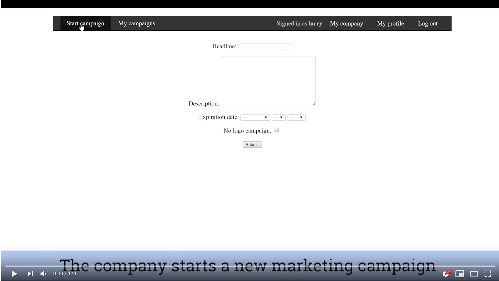
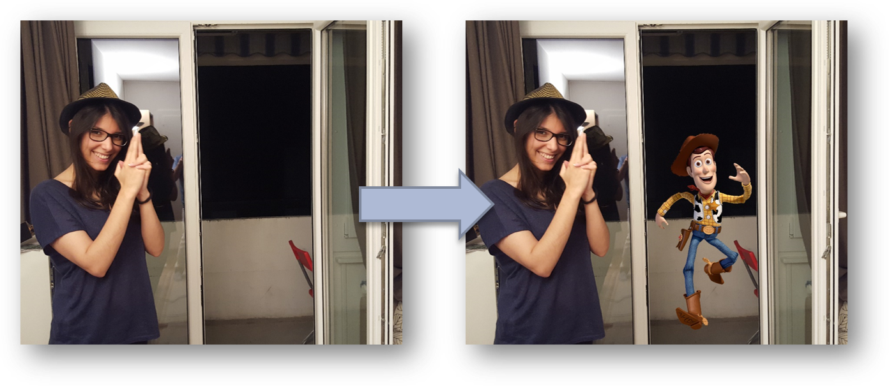
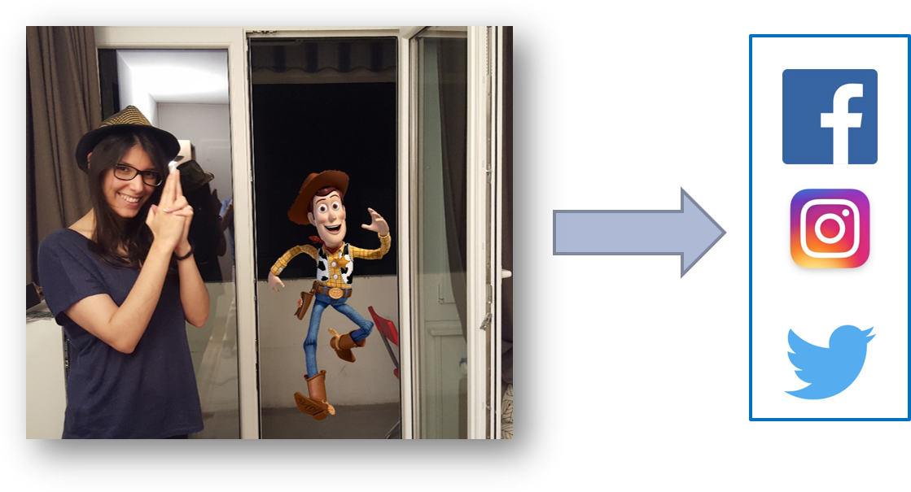

# Advertisement platform

In this project, I designed and developed a web platform for advertisement in Django (Python). This project focused entirely on the platform design, back-end development and the minimum viable front-end (functionality was heavily prioritized over beauty).

Django is used for the backend. Some additionnal libraries are used, such as *PIL* for the image processing or *allauth* to handle logins with social media.

The frontend is created using HTML/CSS/JavaScript, and jQuery for the image manipulation.

You can find all the code in the ``src/`` folder

**Table of Contents:**

[Demo](#Demo) - Short video of the platform in action 
[Project Idea](#Project-idea) - How does it work 
[Matching requirements](#Matching-requirements) - Some interesting constraints that the platform tries to solve 
[Architecture](#Architecture) - An overview of the platform architecture

## Demo
Here is a 1 minute demo of the final project (everything you see is working in the backend):

    
     
    <em>Clicking on the video will take you to youtube</em>

## Project Idea
The main idea is to have "social media celebrities" advertise on behalf of companies.

These web celebrities will select products they like, from companies they like and advertise the product on their social media accounts. In contrary to ads you can find on Google or Facebook that are separated from the content produced by users, the ad will be directly integrated to a picture the celebrity creates.

Following is a summary of the steps that will be done on the platform:
1. A company is connected to a web celebrity. 

2. The web celebrity creates an image endorsing the company. 

3. The web celebrity posts the image on social media. 

4. The company renumerates the web celebrity. 

## Matching requirements
The main problem that needs to be solved, is how to match the workers (web celebrities) and the companies. Looking at the goals of each actor, we have that:

1. The companies want to:
    1. Maximize their positive visibility.
    2. Minimize the money spent.
2. The workers want to:
    1. Maximize the money they earn.
    2. Minimize (on their audience) the negative looks they could get from making ads.
    3. Minimize the work they do.
3. The platform wants to:
    1. Maximize the amount and number of transactions between the companies and workers.
    

Most of the goals are pretty standard (minimizing spent money for companies, which is opposed to maximizing earned money for workers), and a middle ground is not difficult to find. However two goals can be deal breakers:
1. Companies will want to have control over who is promoting their brand.
2. Web celebrities also want to have some control over which companies they promote: for example a sportsman may not want to promote unhealthy food.

This leads us to our architecture that tries maximize the number of possible transactions knowing these limitations.

## Architecture
- The companies will be able to select which web celebrities they would accept to be associated with. For each celebrity (or group of celebrity), they will propose a price that they are wi lling to offer to them if the celebrity posts a sponsored picture.
- A celebrity will see all the companies that have made a propostion to him, ordered (by default) by how both the companies and the worker would fit together.
- Once a celebrity has accepted a proposition, he will need to prepare a picture to post. He will take a picture, that he will then modify with the platform to promote the company.
- The picture will then be sent to the company for validation.
- Once the company has validated the picture, it will be posted on social media accounts of the celebrity.
- In the long run, different metrics would be compiled (number of likes on the picture, effectiveness of the collaboration, etc.) and will allow the system to improve the matching proposition between companies and celebrities

Below, you can find the detailed architecture of the system as it was implemented here:

