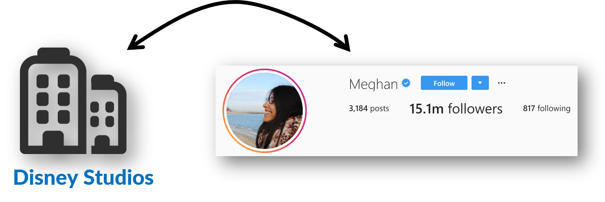

# Advertisement platform - Django

This web platform allows social media users to advertise products on behalf of companies in fun and innovative ways.

This project focused on:
- Platform architecture design
- Backend development: **Django** (Python), with some additionnal libraries (*PIL* for the image processing or *allauth* to handle logins with social media.)
- Minimum viable front-end (functionality was heavily prioritized over beauty): **HTML/CSS/JavaScript**, and **jQuery** for the image manipulation.

You can find all the code in the ``src/`` folder.

**Table of Contents:**

[Demo](#Demo) - Short video of the platform in action 
[Project Idea](#Project-idea) - How does it work 
[Architecture design](#Architecture-design) - An overview of the platform architecture and the choices that lead to it 
[Project requirements](#Project-requirements) - Requirements to run the project

## Demo
Here is a 1 minute demo of the final project (everything you see is working in the backend):

    
     
    <em>Clicking on the video will take you to youtube</em>

## Project Idea
The main idea is to have "social media celebrities" advertise on behalf of companies.

These web celebrities will select products they like, from companies they like and advertise the product on their social media accounts. In contrary to ads you can find on Google or Facebook that are separated from the content produced by users, the ad will be directly integrated to a picture the celebrity creates.

Following is a summary of the steps that will be done on the platform:
1. A company is connected to a web celebrity. 

2. The web celebrity creates an image endorsing the company. 

3. The web celebrity posts the image on social media. 

4. The company renumerates the web celebrity. 

## Architecture design

### Matching requirements
The main problem that needs to be solved, is how to match the workers (web celebrities) and the companies. Looking at the goals of each actor, we have that:

1. The companies want to:
    1. Maximize their positive visibility.
    2. Minimize the money spent.
2. The workers want to:
    1. Maximize the money they earn.
    2. Minimize (on their audience) the negative looks they could get from making ads.
    3. Minimize the work they do.
3. The platform wants to:
    1. Maximize the amount and number of transactions between the companies and workers.
    

Most of the goals are pretty standard (minimizing spent money for companies, which is opposed to maximizing earned money for workers), and a middle ground is not difficult to find. However two goals can be deal breakers:
1. Companies will want to have control over who is promoting their brand.
2. Web celebrities also want to have some control over which companies they promote: for example a sportsman may not want to promote unhealthy food.

This leads us to our architecture that tries maximize the number of possible transactions knowing these limitations.

### Overview
Here are the steps of the decided solution.
- The companies will be able to select which web celebrities they would accept to be associated with. For each celebrity (or group of celebrity), they will propose a price that they are wi lling to offer to them if the celebrity posts a sponsored picture.
- A celebrity will see all the companies that have made a propostion to him, ordered (by default) by how both the companies and the worker would fit together.
- Once a celebrity has accepted a proposition, he will need to prepare a picture to post. He will take a picture, that he will then modify with the platform to promote the company.
- The picture will then be sent to the company for validation.
- Once the company has validated the picture, it will be posted on social media accounts of the celebrity.
- In the long run, different metrics would be compiled (number of likes on the picture, effectiveness of the collaboration, etc.) and will allow the system to improve the matching proposition between companies and celebrities

### Detailed class diagrams
The design was splited into multiple pieces to simplify the visualization and explanations. The blue classes are the one that are explained in the current step, and the grey ones the ones that were previously explained.

1. The celebrity class ``WorkerUserDetails`` extends a ``User`` class. A celebrity will be rated in one or multiple ``Category`` depending on the personality and content they produce (for example: sport, fashion, etc.).  

2. The user class ``CompanyUserDetails`` represents the multiple members of a ``Company`` that will have access to the platform and collaborate with celebrities. A member will be able to launch a marketing ``Campaign``. For each new campaign, they will be able to upload different images stored in the class ``CompanyLogoImage`` that the workers will use to create the ad image. 
The company will then generates a ``CompanyProposition`` to all workers it would accept to work with.  

3. Once a worker (``WorkerUserDetails``) connects to the platform, they will be able to see all the propositions companies have made to them. Each time they load the page, an ``Auction`` is run with all the company propositions. The CompanyProposition will wrapped inside an ``AuctionElement``, which will be displayed to the user by an order defined by the field *final_score*. This score is computed using different factors: past succesfull collaboration done with the company, the campaign quality score, a fitting factor that defined how well the company and worker should collaborate, etc.  

4. Once a user has accepted a company proposition, they will prepare a final picture that supports the company/product. They will take a picture that will be uploaded within the class ``TransformedImageBuilder``. They will be able to select which ``CompanyLogoImage`` to use to merge boths images together. The final result will be kept in an immutable instance of ``TransformedImage``. Once done, the transformed image will be kept in a ``UserProposition``, that the user will be able to send to the company. A user is able to make multiple UserProposition either at the start, or later if they were rejected.  

5. Finally, a company can accept a user proposition  or turn it down, both times explaining the reasons for doing so.  

All the classes highlighted in the description above were implemented. Some minor changes between the class diagram and final implementations may have happen. Here is the final class diagram of the system as it was implemented:

### Implementation
The user classes have been described in ``src/aiaUsers``. ``src/campaignManager`` handles everything related to the campaign, including the ``CompanyProposition``, the ``UserProposition`` and everything related to the ``Auction``. ``src/imageModifier`` handles the image transformation, both the JavaScript in the frontend that allow the celebrity to modify the image in the browser, and the backend that perform the final transformation using the python *PIL* library.

User management and authorization has been entirely handled. The celebrity users and company users each have access to different part of the platform, and anonymous users are always redirected to a login page when trying to access any secured page.

## Project requirements
This project uses Python 3.5 with Django 1.9. 
SQLite3 was used as a database to test the platform.
